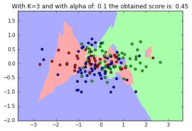

# K-NN

This project is implmentation of K-Nearest Neighbor (KNN) model. 

In this project, the PCA is applied on data, and the first two components are chosen for KNN. With these two components,  the obtained score is about 90%. But for testing the KNN algorithm more effectively, test is done with further components of PCA.
The KNN algorithm classifies new observations by looking at the K nearest neighbors, looking at their labels, and assigning the majority (most popular) label to the new observation. We can also use weight function, which simply implies that which sample should contribute more in decision. Weight function could be uniform, distance, or user defined which the Gaussian function is implmented as the additional weight function. 

For the first part of this exercise, as we increasing the K, algorithm calculate more nearest neighbors, this is good when we have noisy data, As K increases, the error usually goes down, then stabilizes, and then raises again. It can be seen from the plots that in lower K, decision regions getting smaller pieces.
Weight function: this parameter implies that which near neighbor can have more effect. Distance weight function means, nearest neighbors are more important. For the defined Gaussian function, it takes distance as input of function and calculate the result, simply if alpha is higher very close neighbors are very important, for example if alpha=0.1, the Gaussian function became like below. By using Gaussian function, by increasing alpha decision regions gets smaller. The best weight function and K parameter are found by using grid search. 

