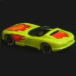
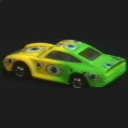
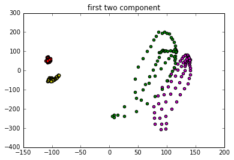
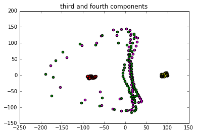
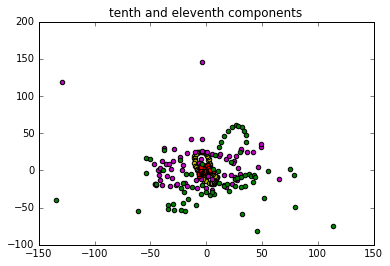

# Principal Component Analysis (PCA)

Applying PCA over COIL-100 dataset with 100 visual object categories. Object are classified with Naive Bayes classifier with Gaussian class-conditional distribution. Some sample of COIL-100 dataset are:

The first 20 components of PCA is computed, and the scatter plot of different components of PCA is depicted.

As it can be seen from the scattered plot, class sample are easily separable, and so the classification of first two components can be done easily. For the third and fourth components it is a little bit difficult to classify all four parts. For the third and fourth pairs, classification of green samples and purple ones seems difficult with the scattered PCA of samples. But the worst case is tenth and eleventh components, which nearly all the samples are located all mixed together and there is not sufficient variance between samples to classify them with simple ML models.

We choose higher number of principal components to preserve naunces of data and to have less distortion, but in classifying the few first ones are the most important ones.

## Classification
As I used random splitting function so results change, but as average, if we choose the first two components, the score will be around 90%, where if we use third and fourth components, the score become less and about 70-75%. As conclusion, the first two components of PCA keep the most variance between samples and for classification give us the best score.