# SVM with K-fold cross validation and Radial Basis Function (RBF) kernel

As the first step in this project, linear SVM is used to check effect of various C on boundaries and scoring result on validation dataset and so on test data set. At below you can find training set samples plotted on decision boundaries of SVM after training. 

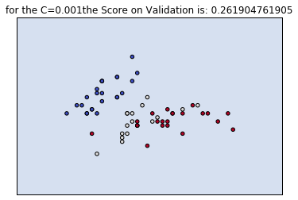
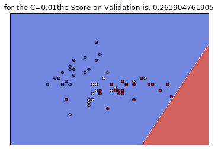
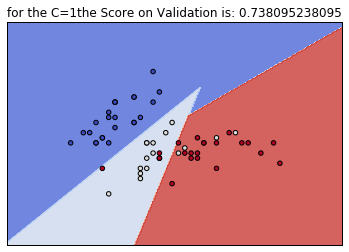

Here is the graph showing how the score on validation set change when changing C. as we are using random splitting function, results will change in every iteration.
How the boundaries change? A low C makes the decision surface smooth, while a high C aims at classifying all training examples correctly.

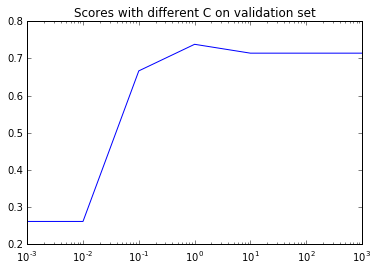

Now plotting test data set and score with best achieved C. the score of 0.73 is achieved on test data set. As used search on validation data to find C parameter, it should give us good score.

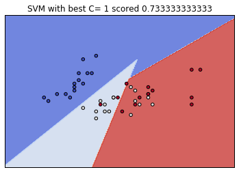

Now examining different C with RBF kernel. For this section changing C and observe different boundaries, without changing any gamma, which python set it automatically. Again it can be seen that lower C makes boundaries simpler, and higher C try to classify more samples. Below is a graph which shows the scores on different C. this scores change every time in every run.

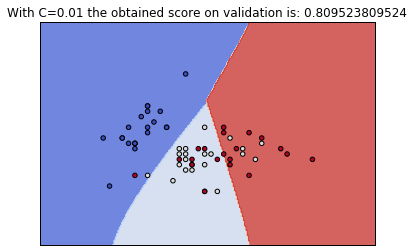
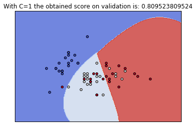
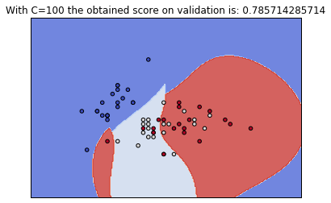
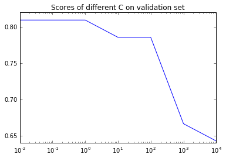

Now scoring test data, when best C on validation is chosen.

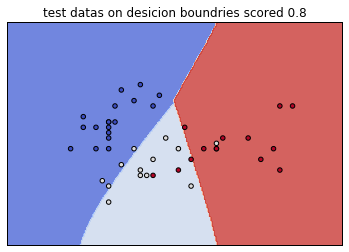

After all, we used gamma and C for tuning. Gamma defines how much influence a single training example has. The higher gamma is, the closer other examples must be to affected. Below is a table shows different score, these scores will change, but the point is that using K-fold validation test usually give better score than single validation set. Only for the testing phase of K-fold validation set, validation set is concatenated with training set. There is another table shows effect of changing gamma and C on scoring in percentage, which in grid search be take the best combination. At the end, decision boundaries and test samples are plotted, where parameters are tuned by grid search and without K-fold validation. 

| Tuned by grid search on validation result | Tuned by grid search on validation, scored on test result | Tuned by grid search and 5-fold validation, scored on test result |
|------------------------------------------|-------------------------------------------------------|--------------------------------------------------|
| 83%                                     | 86%                                                 | 88%                                              |

### **Effect of Changing Gamma and C on Scoring (in %)**

| Gamma \ C | 0.01 | 0.1  | 1    | 10   | 100  | 1000 | 10000 |
|-----------|------|------|------|------|------|------|-------|
| 10⁻⁹      | 78   | 78   | 78   | 78   | 78   | 78   | 78    |
| 10⁻⁷      | 80   | 80   | 80   | 80   | 80   | 80   | 80    |
| 10⁻⁵      | 78   | 78   | 78   | 78   | 78   | 78   | 80    |
| 10⁻³      | 80   | 80   | 80   | 80   | 80   | 80   | 80    |
| 10⁻¹      | 80   | 80   | 80   | 80   | 80   | 80   | 76    |
| 10⁰       | 83   | 83   | 83   | 78   | 66   | 64   | 61    |

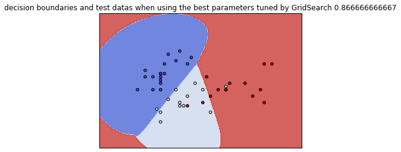
