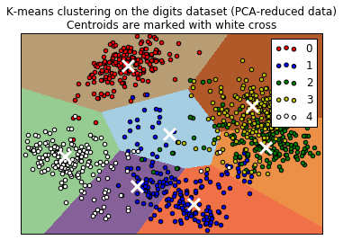

# Clustering with GMM and K-means

In this project, classes of [0,1,2,3,4] of digits dataset are chosen and then K-Means algorithm is trained with different number of clusters varying from 3 to 10 cluster. The center of each cluster is marked with a white 'X'.

For the gaussian mixture, GMM algorithm used for clustering and different parameters of evaluation, homogeneity, normalized mutual information and purity are ploted.

Homogeneity of a cluster mean all the samples in that cluster are belong to same class. 
Normalized mutual information is a score shows the similarity between two labels of the same data. 
Purity is the percent of the total number of objects(data points) that were classified correctly, in the unit range. If we make number of clusters higher, purity will get close to 1.

