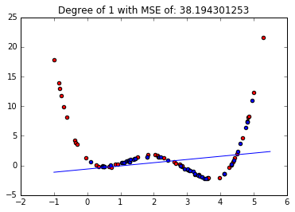
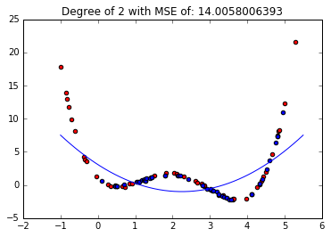
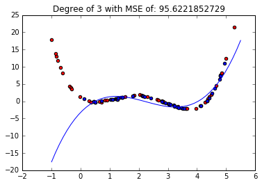
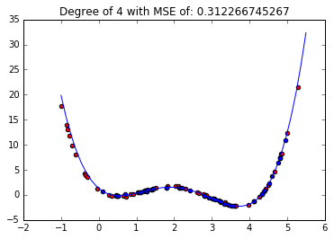
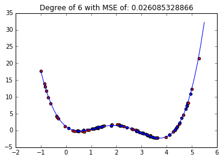
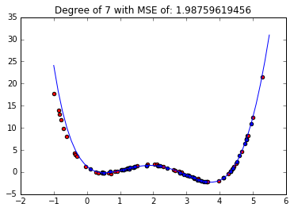
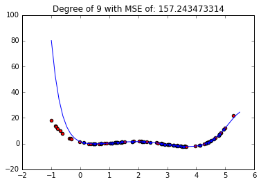

# Regression

# Project description

This is the implmentation of the linear regression model on a given data. Dataset is plotted, and fitted on linear regression model, with degrees from 1 to 10, and the best degree is found.

The results are shown below. Showing, in choosing degree of polynomial, we have two problem. Over fitting and under fitting. As it can be seen if we choose lower degree of polynomial (Under fitting), the green line does not fit the samples, and we are going to have high mean square error. Also, if we choose higher degree more than 8, the mean square error goes higher rapidly. In this case, we have over fitting, which simply means the regression describes random error or noise instead of underlying relations. 
In this exercise the best answer is regression with degree =6, which gives us the mean square error of about 11, which is the lowest among others.

